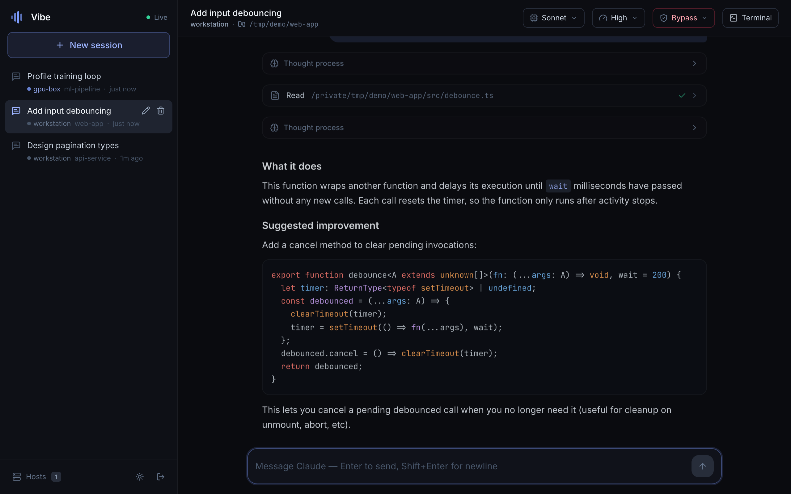
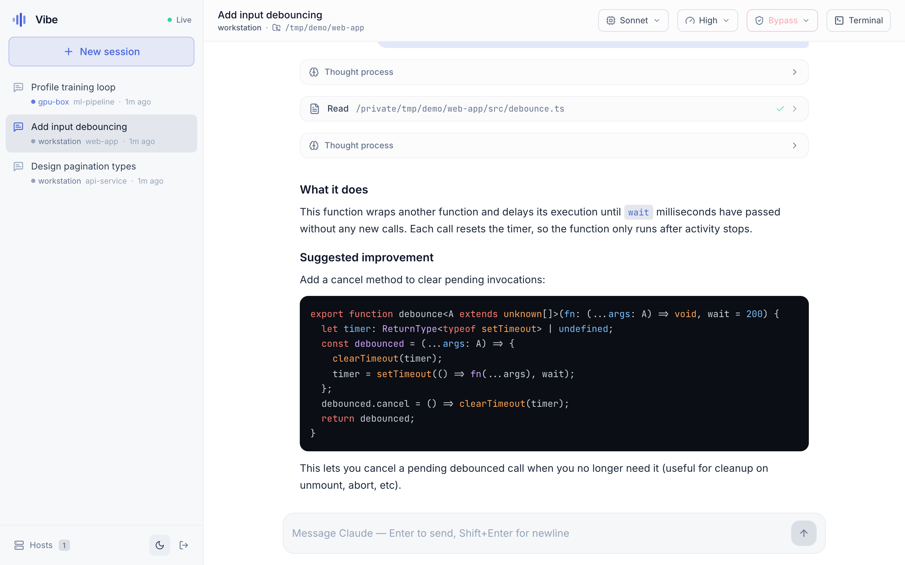
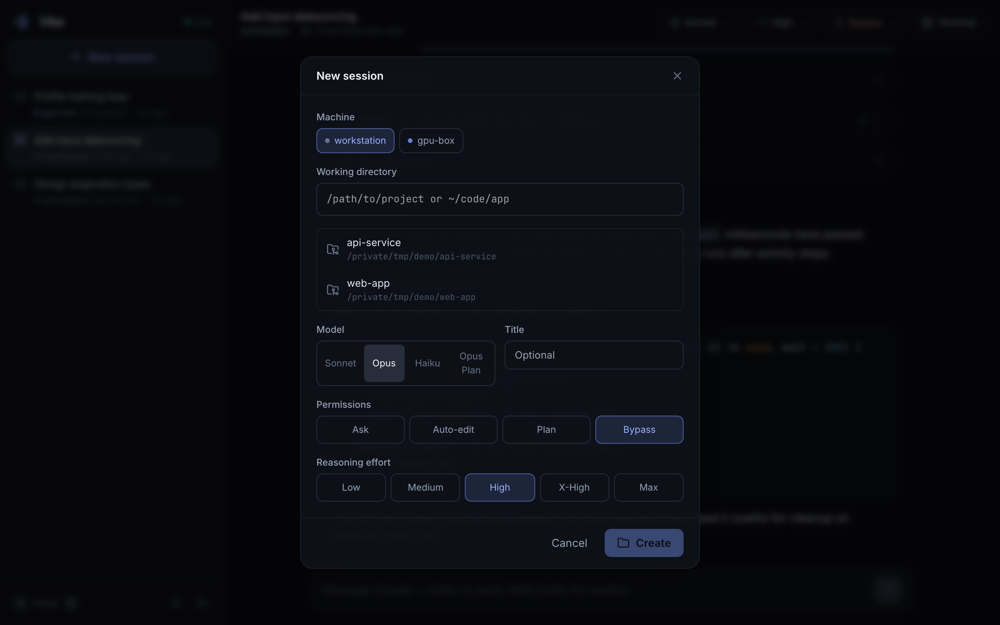
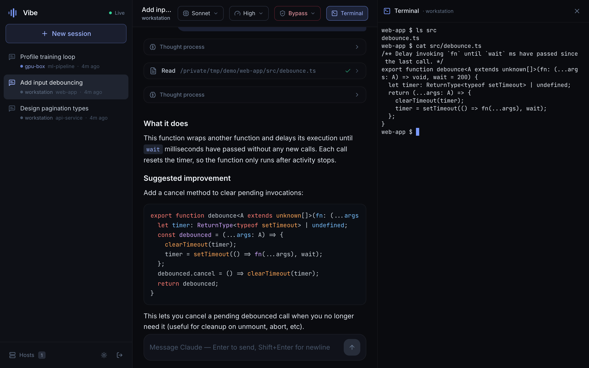

<div align="center">

# Vibe

**English** · [简体中文](README.zh-CN.md)

**An elegant, low‑latency web UI for driving Claude Code on any machine.**

Run it on the machine where your code lives, open the printed link from any browser
(laptop, phone, tablet), and vibe‑code remotely with smooth streaming and a clean interface.

<br/>



<table>
<tr>
<td width="33%" align="center"><br/><sub><b>Dark &amp; light themes</b></sub></td>
<td width="33%" align="center"><br/><sub><b>Start on any machine</b></sub></td>
<td width="33%" align="center"><br/><sub><b>Built‑in terminal</b></sub></td>
</tr>
</table>

</div>

---

## Why Vibe

Vibe runs a small server on your machine that talks to Claude Code through the official
[`@anthropic-ai/claude-agent-sdk`](https://www.npmjs.com/package/@anthropic-ai/claude-agent-sdk),
and streams a structured conversation to a React web client over a single WebSocket.

It was built to fix two things that make other remote Claude UIs feel clunky:

- **Communication that never stalls.** Every state change carries a monotonic `seq`.
  Reconnects replay only what you missed instead of refetching the whole transcript,
  streaming text is coalesced per animation frame, and a backpressure‑aware sender drops
  only best‑effort delta frames (never structural ones) when a client falls behind.
- **An interface that feels good.** A calm dark or light theme, real‑time
  token/thinking/tool streaming, thoughts that expand while Claude thinks and collapse when
  done, tool cards with live status, inline permission prompts, a context‑usage meter, and
  an integrated terminal.

## Features

- 💬 **Structured chat loop** — streaming assistant text, thinking, tool calls, and results
- 🧰 **Tool visibility** — Bash/Read/Edit/Grep/… rendered as compact cards with status + output
- 🔐 **Inline permission prompts** — Allow / Always allow / Deny, honoring your Claude settings
- 🗂 **Sessions** — create in any directory, resume, rename, delete; history loaded from `~/.claude`
- 🖥️ **Picks up your CLI sessions** — conversations you started in the terminal with `claude`
  appear automatically (tagged **CLI**); open them to read the full history and keep chatting,
  resuming with the same model the session was using
- 🌐 **Remote hosts over SSH** — add machines you reach via SSH and their Claude Code projects
  show up in the same sidebar, each tagged with its host; open and continue them just like
  local ones (everything runs on that machine, driven over SSH)
- 💻 **Integrated terminal** — one click opens a real interactive shell on the session's host
  (a local login shell, or `ssh` into the remote), in the session's directory, in a resizable
  side panel
- 🎛 **Per‑session model, reasoning effort, and permission mode** switching from the header
- 🌗 **Dark & light themes** with a one‑click toggle (remembers your choice)
- 📈 **Context meter** and per‑turn cost/duration
- 🔁 **Robust reconnection** with seq‑based replay (no lost or duplicated messages)
- 📱 **Responsive** — works on desktop and mobile browsers

## Requirements

- **Node.js 20+**
- **Claude Code** installed and authenticated (`claude` on your `PATH`). Vibe automatically
  uses your existing `claude` binary and its config (MCP servers, `CLAUDE.md`, custom
  `ANTHROPIC_BASE_URL`/model mappings, permission settings — all respected).

## Quick start

```bash
npm install
npm run serve        # builds the web client and starts the server
```

The server prints ready‑to‑open links with an access token:

```
  http://localhost:8787/?token=XXXXXXXX
  http://192.168.1.20:8787/?token=XXXXXXXX   # open this from your phone on the same network
```

Open one of them and start a session.

### Development

```bash
npm run dev          # Vite dev server (5173) + auto-reloading API server (8787)
```

Open `http://localhost:5173/?token=...` (the token is printed by the server process).

## Accessing from another network

Vibe uses a **direct connection** model — the browser connects straight to the server.
On the same LAN, just use the machine's IP. To reach it from anywhere, put it behind a
tunnel such as [Tailscale](https://tailscale.com), [cloudflared](https://github.com/cloudflare/cloudflared),
or `ssh -L`. (No data passes through any third‑party relay.)

## Configuration

All optional, via environment variables:

| Variable | Default | Description |
|---|---|---|
| `VIBE_PORT` | `8787` | Port to listen on |
| `VIBE_HOST` | `0.0.0.0` | Bind address |
| `VIBE_TOKEN` | auto‑generated | Access token (persisted at `~/.vibe/token` if not set) |
| `VIBE_HOME` | `~/.vibe` | Where Vibe stores its token + session index |
| `VIBE_DEFAULT_MODEL` | `opus` | Default model for new sessions |
| `VIBE_DEFAULT_EFFORT` | `high` | Default reasoning effort (`low`/`medium`/`high`/`xhigh`/`max`) |
| `CLAUDE_CLI_PATH` | auto‑detected | Explicit path to the `claude` binary |
| `VIBE_LOCAL_NAME` | machine hostname | Label shown for this (local) machine |
| `VIBE_SSH_HOSTS` | – | Seed remote hosts, e.g. `prod=user@1.2.3.4,gpu=mygpu-alias` |
| `VIBE_SSH` | `ssh` | SSH command to use (override for custom options) |

## Remote hosts (SSH)

Open **Hosts** in the sidebar to add a machine by an `~/.ssh/config` alias or `user@host`.
Vibe lists that host's Claude Code sessions in the same sidebar (tagged with the host name),
and opening or continuing one runs `claude` on that machine over SSH.

Requirements:

- **Key-based auth / ssh-agent** — Vibe connects non-interactively (`BatchMode`), so the host
  must authenticate without a password prompt.
- **`claude` installed on the remote** (the Hosts dialog shows a status dot for each host).
- Remote turns honor the session's **permission mode** (`default`/`acceptEdits`/`plan`/`bypass`);
  interactive per-tool approval prompts are a local-only feature.

## Terminal

The **Terminal** button (top‑right of a session) opens a resizable side panel with a real
interactive shell **on that session's host**, in the session's working directory:

- a local login shell for local sessions, or `ssh -tt` into the host for remote ones;
- the host's full environment is loaded (so version managers like nvm, your aliases, etc. work);
- drag the panel's left edge to resize (the width is remembered).

## How it works

```
Browser (React + Vite)
   │  WebSocket  /ws  (seq‑tagged events, rAF‑coalesced)  +  /terminal  (PTY stream)
   ▼
Vibe server (Node + Express + ws)
   │  local: @anthropic-ai/claude-agent-sdk → your `claude`
   │  remote: ssh → `claude` on the host        terminal: node-pty (local shell / ssh -tt)
   ▼
Claude Code  (runs in your chosen directory, writes ~/.claude transcripts)
```

- **`shared/protocol.ts`** — the single source of truth for the wire protocol.
- **`server/`** — token auth, the Claude runner (local SDK or remote `ssh`, both normalized
  into the same block stream), a per‑session event hub (seq log, replay, backpressure), a
  session metadata store, a transcript reader for history, discovery of existing `~/.claude`
  sessions (local and on remote hosts), and the terminal PTY channel. Deleting a discovered
  session only dismisses it from Vibe — the underlying Claude transcript is never touched.
- **`web/`** — the WebSocket client (reconnect + coalescing), a Zustand store with a block
  reducer, and the UI (chat, sidebar, terminal panel).

## Security

- All HTTP and WebSocket traffic requires the access token.
- Vibe can run arbitrary tools through Claude Code on your machine — only expose it on
  networks you trust, and prefer a tunnel over opening a public port.
- Permission prompts and tool policies follow your existing Claude Code settings.

## License

MIT
