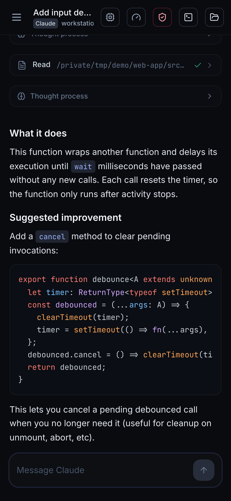
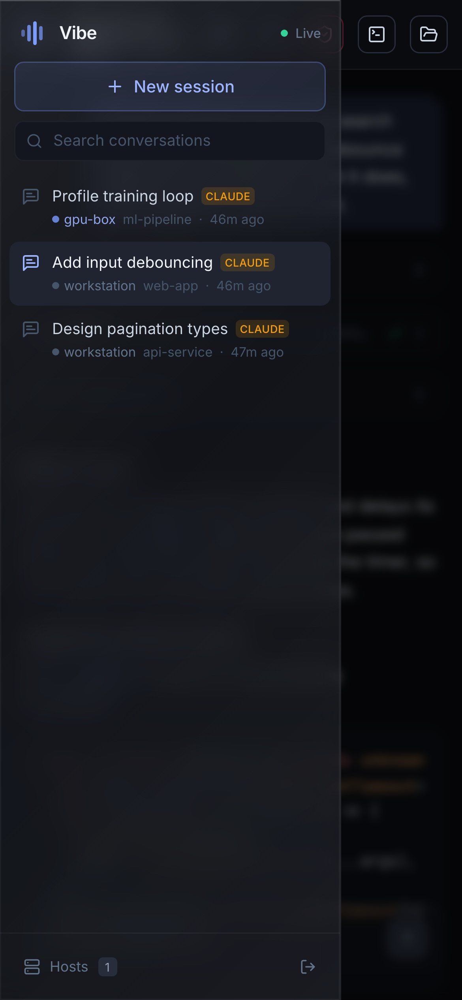

<div align="center">

# Vibe

**English** · [简体中文](README.zh-CN.md)

**An elegant, low‑latency web UI for driving Claude Code, Codex, and Cursor agents on any machine.**

Run it on the machine where your code lives, open the printed link from any browser
(laptop, phone, tablet), and vibe‑code remotely with smooth streaming and a clean interface.

<br/>


<table>
<tr>
<td width="33%" align="center"><br/><sub><b>Dark &amp; light themes</b></sub></td>
<td width="33%" align="center"><br/><sub><b>Start on any machine</b></sub></td>
<td width="33%" align="center"><br/><sub><b>Built‑in terminal</b></sub></td>
</tr>
</table>

<br/>

<table>
<tr>
<td align="center" width="50%"></td>
<td align="center" width="50%"></td>
</tr>
<tr>
<td align="center"><sub><b>Streaming chat on mobile</b></sub></td>
<td align="center"><sub><b>Sessions &amp; navigation</b></sub></td>
</tr>
</table>

</div>

---

## Why Vibe

Vibe runs a small server on your machine that talks to Claude Code, Codex, or the
Cursor agent, normalizes each agent's stream into the same structured conversation
model, and sends it to a React web client over a single WebSocket. Claude sessions
use the official [`@anthropic-ai/claude-agent-sdk`](https://www.npmjs.com/package/@anthropic-ai/claude-agent-sdk);
Codex and Cursor sessions run their headless CLIs.

It was built to fix two things that make other remote coding-agent UIs feel clunky:

- **Communication that never stalls.** Every state change carries a monotonic `seq`.
  Reconnects replay only what you missed instead of refetching the whole transcript,
  streaming text is coalesced per animation frame, and a backpressure‑aware sender drops
  only best‑effort delta frames (never structural ones) when a client falls behind.
- **An interface that feels good.** A calm dark or light theme, real‑time
  token/thinking/tool streaming, thoughts that expand while the agent thinks and collapse when
  done, tool cards with live status, inline permission prompts, a context‑usage meter, and
  an integrated terminal.

## Features

- 💬 **Structured chat loop** — streaming assistant text, thinking, tool calls, and results
- 🧰 **Tool visibility** — Bash/Read/Edit/Grep/… rendered as compact cards with status + output
- 🤖 **Multiple agents** — choose Claude, Codex, or Cursor per session, with agent-specific
  model, reasoning, and permission controls
- 🔐 **Permission controls** — Claude supports inline Allow / Always allow / Deny prompts;
  Codex and Cursor use their supported headless permission/sandbox modes
- 🗂 **Sessions** — create in any directory, resume, rename, delete; history loaded from
  agent transcript stores and Vibe-managed transcripts where available
- 🖥️ **Picks up your CLI sessions** — conversations you started in the terminal with
  `claude`, `codex`, or `cursor-agent` appear automatically when their local history is readable;
  open them to read the full history and keep chatting
- 🌐 **Remote hosts over SSH** — add machines you reach via SSH and run the selected agent
  on that machine; remote Claude Code sessions are discovered automatically, and Vibe-created
  remote sessions can use Claude, Codex, or Cursor when the CLI is installed on the host
- 💻 **Integrated terminal** — one click opens a real interactive shell on the session's host
  (a local login shell, or `ssh` into the remote), in the session's directory, in a resizable
  side panel
- 🎛 **Per‑session controls** — choose the agent when creating a session, then switch
  model, reasoning effort, and permission mode from the header
- 🌗 **Dark & light themes** with a one‑click toggle (remembers your choice)
- 📈 **Context meter** and per‑turn cost/duration
- 🔁 **Robust reconnection** with seq‑based replay (no lost or duplicated messages)
- 📱 **Responsive** — works on desktop and mobile browsers

## Requirements

- **Node.js 20+**
- **At least one supported agent CLI** installed and authenticated on the machine running Vibe:
  - Claude Code (`claude`)
  - Codex CLI (`codex`)
  - Cursor CLI / agent (`cursor-agent`)

Vibe auto-detects these binaries on `PATH` and common install locations. It uses each
CLI's existing authentication and config; for Claude that includes MCP servers,
`CLAUDE.md`, custom `ANTHROPIC_BASE_URL`/model mappings, and permission settings.

## Quick start

```bash
npm install
npm run serve        # builds the web client and starts the server
```

The server prints ready‑to‑open links with an access token:

```
  http://localhost:8787/?token=XXXXXXXX
  http://192.168.1.20:8787/?token=XXXXXXXX   # open this from your phone on the same network
```

Open one of them and start a session.

### Development

```bash
npm run dev          # Vite dev server (5173) + auto-reloading API server (8787)
```

Open `http://localhost:5173/?token=...` (the token is printed by the server process).

## Accessing from another network

Vibe uses a **direct connection** model — the browser connects straight to the server.
On the same LAN, just use the machine's IP. To reach it from anywhere, put it behind a
tunnel such as [Tailscale](https://tailscale.com), [cloudflared](https://github.com/cloudflare/cloudflared),
or `ssh -L`. (No data passes through any third‑party relay.)

## Configuration

All optional, via environment variables:

| Variable | Default | Description |
|---|---|---|
| `VIBE_PORT` | `8787` | Port to listen on |
| `VIBE_HOST` | `0.0.0.0` | Bind address |
| `VIBE_TOKEN` | auto‑generated | Access token (persisted at `~/.vibe/token` if not set) |
| `VIBE_HOME` | `~/.vibe` | Where Vibe stores its token + session index |
| `VIBE_DEFAULT_MODEL` | `opus` | Default Claude model for new sessions |
| `VIBE_DEFAULT_EFFORT` | `max` | Default reasoning effort for Claude/Codex (`low`/`medium`/`high`/`xhigh`/`max`) |
| `VIBE_DEFAULT_CURSOR_MODEL` | `auto` | Default Cursor model for new sessions |
| `VIBE_DEFAULT_CODEX_MODEL` | `auto` | Default Codex model for new sessions |
| `CLAUDE_CLI_PATH` | auto‑detected | Explicit path to the `claude` binary |
| `CURSOR_CLI_PATH` | auto‑detected | Explicit path to the `cursor-agent` binary |
| `CODEX_CLI_PATH` | auto‑detected | Explicit path to the `codex` binary |
| `VIBE_LOCAL_NAME` | machine hostname | Label shown for this (local) machine |
| `VIBE_SSH_HOSTS` | – | Seed remote hosts, e.g. `prod=user@1.2.3.4,gpu=mygpu-alias` |
| `VIBE_SSH` | `ssh` | SSH command to use (override for custom options) |

## Remote hosts (SSH)

Open **Hosts** in the sidebar to add a machine by an `~/.ssh/config` alias or `user@host`.
Vibe can run Claude, Codex, or Cursor turns on that machine over SSH. Existing remote
Claude Code sessions are discovered in the sidebar (tagged with the host name), and
Vibe-created remote sessions continue with whichever agent you selected for that session.

Requirements:

- **Key-based auth / ssh-agent** — Vibe connects non-interactively (`BatchMode`), so the host
  must authenticate without a password prompt.
- The selected agent CLI installed and authenticated on the remote (`claude`, `codex`, or
  `cursor-agent`). The Hosts dialog currently probes `claude` for its status dot.
- Remote turns honor the session's supported **permission mode**. Interactive per-tool
  Claude approval prompts are a local-only feature; Codex and Cursor use headless modes.

## Terminal

The **Terminal** button (top‑right of a session) opens a resizable side panel with a real
interactive shell **on that session's host**, in the session's working directory:

- a local login shell for local sessions, or `ssh -tt` into the host for remote ones;
- the host's full environment is loaded (so version managers like nvm, your aliases, etc. work);
- drag the panel's left edge to resize (the width is remembered).

## How it works

```
Browser (React + Vite)
   │  WebSocket  /ws  (seq‑tagged events, rAF‑coalesced)  +  /terminal  (PTY stream)
   ▼
Vibe server (Node + Express + ws)
   │  local: Claude SDK → `claude`; `codex exec --json`; `cursor-agent --output-format stream-json`
   │  remote: ssh → selected agent CLI on the host        terminal: node-pty (local shell / ssh -tt)
   ▼
Agent CLI  (runs in your chosen directory; history is read from Claude/Codex/Cursor stores or Vibe transcripts)
```

- **`shared/protocol.ts`** — the single source of truth for the wire protocol.
- **`server/`** — token auth, agent runners (Claude SDK plus Codex/Cursor CLI runners,
  local or remote over `ssh`, all normalized into the same block stream), a per‑session
  event hub (seq log, replay, backpressure), a session metadata store, transcript readers
  for history, discovery of existing Claude/Codex/Cursor sessions where available, and the
  terminal PTY channel. Deleting a discovered session only dismisses it from Vibe — the
  underlying agent transcript is never touched.
- **`web/`** — the WebSocket client (reconnect + coalescing), a Zustand store with a block
  reducer, and the UI (chat, sidebar, terminal panel).

## Security

- All HTTP and WebSocket traffic requires the access token.
- Vibe can run arbitrary tools through the selected agent CLI on your machine — only expose it on
  networks you trust, and prefer a tunnel over opening a public port.
- Permission prompts and tool policies follow each agent's supported permission model.

## License

MIT
