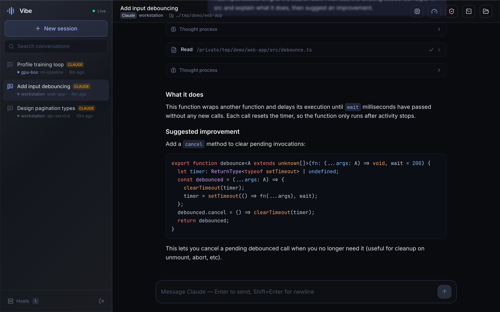
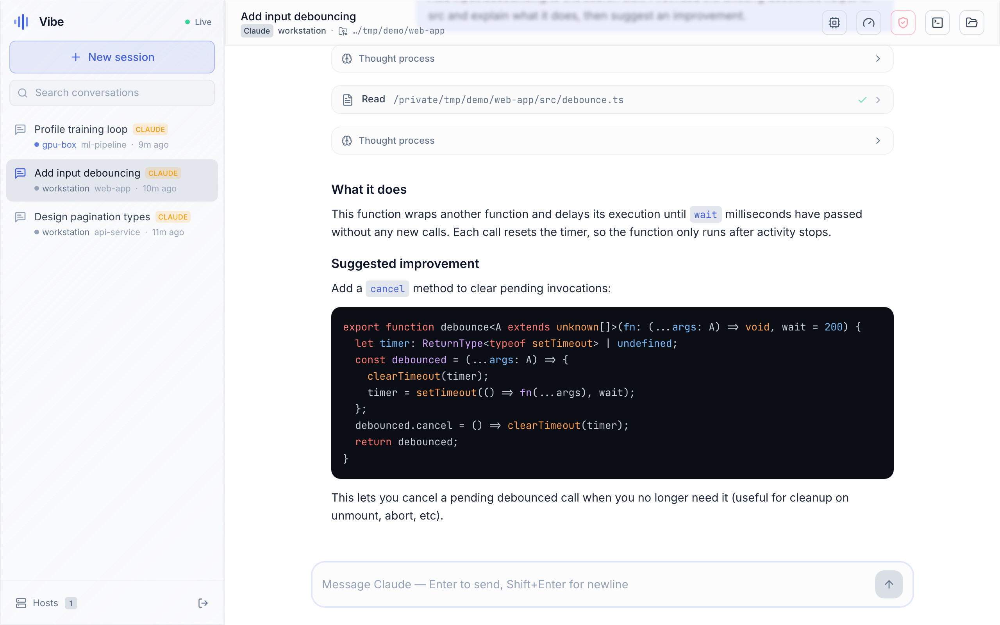
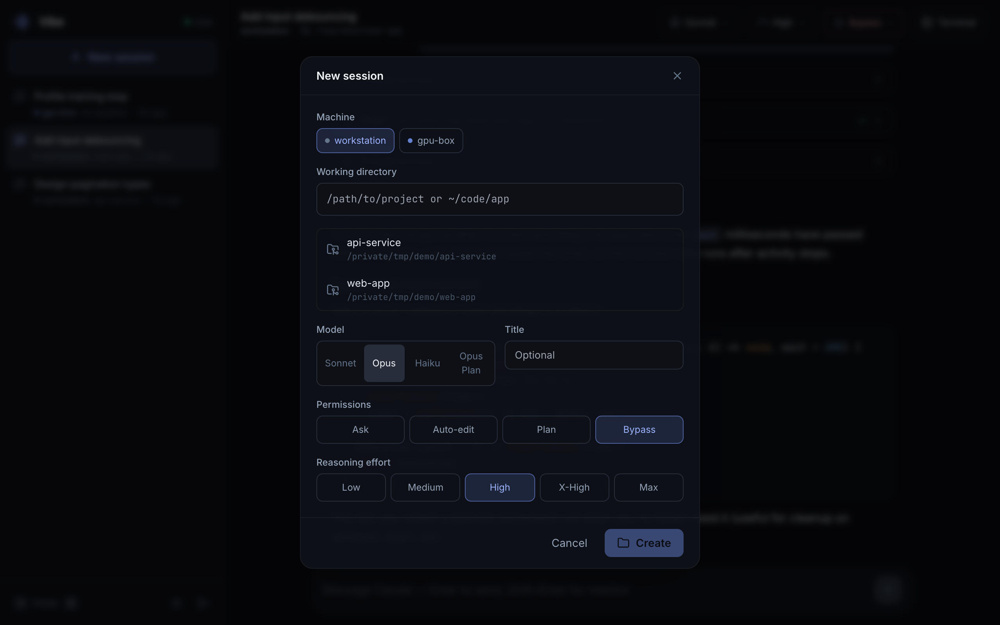
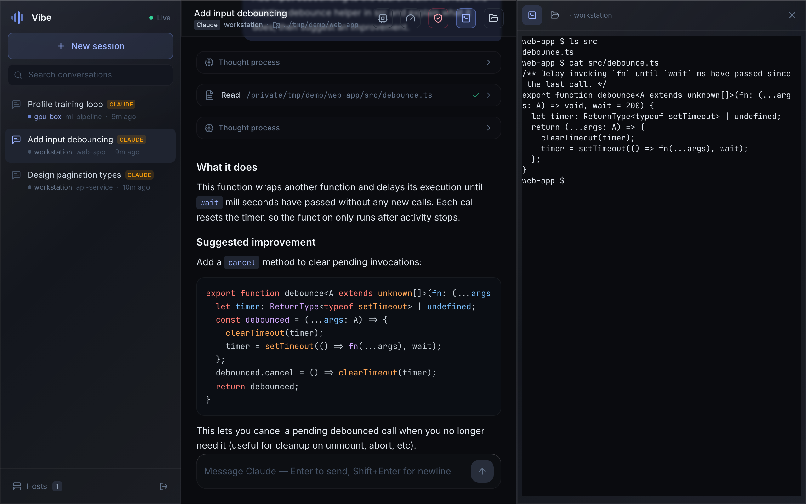
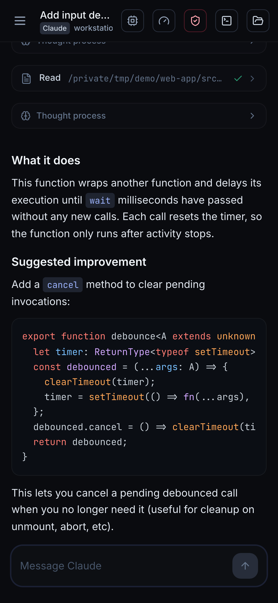
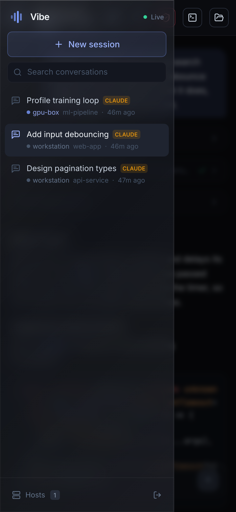

<div align="center">

# Vibe

[English](README.md) · **简体中文**

**优雅、低延迟的 Web 界面,在任意机器上驱动 Claude Code、Codex、Cursor 和 Kimi。**

在你代码所在的机器上运行它,用任意浏览器(笔记本、手机、平板)打开启动时打印的链接,
即可远程 vibe coding —— 流畅的流式输出 + 简洁的界面。

<br/>



<table>
<tr>
<td width="33%" align="center"><br/><sub><b>深色 / 浅色主题</b></sub></td>
<td width="33%" align="center"><br/><sub><b>在任意机器上开始</b></sub></td>
<td width="33%" align="center"><br/><sub><b>内置终端</b></sub></td>
</tr>
</table>

<br/>

<table>
<tr>
<td align="center" width="50%"></td>
<td align="center" width="50%"></td>
</tr>
<tr>
<td align="center"><sub><b>移动端流式聊天</b></sub></td>
<td align="center"><sub><b>会话与导航</b></sub></td>
</tr>
</table>

</div>

---

## 简介

Vibe 在你的机器上运行一个小型服务器,连接 Claude Code、Codex、Cursor 或 Kimi Code,
把各 agent 的输出归一化为同一套结构化对话,再通过单条 WebSocket 推送给 React Web 客户端。
Claude 使用官方 [`@anthropic-ai/claude-agent-sdk`](https://www.npmjs.com/package/@anthropic-ai/claude-agent-sdk),
其余 agent 使用各自的 headless CLI。

它专为解决远程 coding-agent UI 的两个卡顿痛点而生:

- **永不卡顿的通信。** 每次状态变更都带单调递增的 `seq`;重连时只重放你错过的部分,
  而不是重新拉取整段对话;流式文本按动画帧合并;当客户端跟不上时,具备背压感知的发送器
  只丢弃尽力而为的增量帧(绝不丢弃结构性帧)。
- **顺手的界面。** 沉静的深色 / 浅色主题,实时的 token / 思考 / 工具流式展示,思考过程在
  Claude 思考时自动展开、结束后自动折叠,带实时状态的工具卡片,内联权限确认,上下文用量
  计量,以及内置终端。

## 功能特性

- 💬 **结构化对话循环** —— 流式的助手文本、思考、工具调用与结果
- 🧰 **工具可视化** —— Bash/Read/Edit/Grep/… 以紧凑卡片呈现,带状态与输出
- 🤖 **多 Agent** —— 每个会话可选择 Claude、Codex、Cursor、Kimi 或 Kiro
- 🔐 **权限控制** —— Claude 支持内联允许 / 始终允许 / 拒绝;Kimi 会从当前主机自动发现模型及
  Default / Plan / Auto / YOLO 模式,并通过 ACP 处理授权;Kiro 通过 ACP 支持 Ask / Plan / Auto-edit / Bypass
- 🗂 **会话管理** —— 在任意目录创建、恢复、重命名、删除;可读取各 agent 的本地历史
- 🖥️ **自动接管你的 CLI 会话** —— 终端中由 `claude`、`codex`、`cursor-agent`、`kimi` 或 `kiro-cli` 创建的对话可自动出现;
  打开即可阅读完整历史并继续对话,并沿用该会话当时使用的模型
- 🌐 **通过 SSH 管理远程主机** —— 添加可通过 SSH 访问的机器,它们的 Claude Code 项目会出现在
  同一侧栏(各自标注主机名);像本地会话一样打开和继续(全部在该机器上通过 SSH 运行)
- 💻 **内置终端** —— 一键在会话所在主机上打开真实的交互式 shell(本地登录 shell,或 `ssh`
  进入远端),工作目录即会话目录,位于可调宽度的侧栏面板中
- 🎛 **按会话切换模型、推理强度(effort)与权限模式**,直接在顶栏操作
- 🌗 **深色 / 浅色主题**,一键切换(记住你的选择)
- 📈 **上下文用量计量**,以及每轮的花费 / 耗时
- 🔁 **健壮的重连**,基于 seq 重放(消息不丢失、不重复)
- 📱 **响应式** —— 桌面和移动端浏览器均可用
- 🤖 **Telegram bot** —— 用 Telegram 创建 / 切换会话、流式对话、处理权限确认

## 环境要求

- **Node.js 20+**
- 至少安装并认证一个受支持的 agent CLI: `claude`、`codex`、`cursor-agent`、`kimi` 或 `kiro-cli`。
  Vibe 会从 `PATH` 和常见安装位置自动检测,包括 Kimi 原生安装路径 `~/.kimi-code/bin/kimi`
  以及 Kiro 默认路径 `~/.local/bin/kiro-cli`。

## 快速开始

```bash
npm install
npm run serve        # 构建 Web 客户端并启动服务器
```

服务器会打印带访问令牌、可直接打开的链接:

```
  http://localhost:8787/?token=XXXXXXXX
  http://192.168.1.20:8787/?token=XXXXXXXX   # 在同一局域网下用手机打开这个
```

打开其中任意一个即可开始会话。

### 开发

```bash
npm run dev          # Vite 开发服务器(5173) + 自动重载的 API 服务器(8787)
```

打开 `http://localhost:5173/?token=...`(令牌由服务器进程打印)。

## 从其他网络访问

Vibe 采用**直连**模式 —— 浏览器直接连接服务器。在同一局域网内,直接用机器的 IP 即可。
要从任意地方访问,可以把它放在隧道后面,例如 [Tailscale](https://tailscale.com)、
[cloudflared](https://github.com/cloudflare/cloudflared) 或 `ssh -L`。(没有数据经过任何
第三方中继。)

## 配置

全部可选,通过环境变量设置:

| 变量 | 默认值 | 说明 |
|---|---|---|
| `VIBE_PORT` | `8787` | 监听端口 |
| `VIBE_HOST` | `0.0.0.0` | 绑定地址 |
| `VIBE_TOKEN` | 自动生成 | 访问令牌(未设置时持久化到 `~/.vibe/token`) |
| `VIBE_HOME` | `~/.vibe` | Vibe 存放令牌 + 会话索引的位置 |
| `VIBE_DEFAULT_MODEL` | `opus` | 新会话的默认模型 |
| `VIBE_DEFAULT_EFFORT` | `max` | 默认推理强度(`low`/`medium`/`high`/`xhigh`/`max`/`ultra`) |
| `VIBE_DEFAULT_CURSOR_MODEL` | `auto` | Cursor 新会话的默认模型 |
| `VIBE_DEFAULT_CODEX_MODEL` | `auto` | Codex 新会话的默认模型 |
| `VIBE_DEFAULT_KIMI_MODEL` | `auto` | Kimi 新会话的默认模型别名;`auto` 沿用 Kimi 配置 |
| `VIBE_DEFAULT_KIRO_MODEL` | `auto` | Kiro 新会话的默认模型;`auto` 由 Kiro 自行选择 |
| `VIBE_DEFAULT_AGENT` | `claude` | 默认 agent(`claude`/`cursor`/`codex`/`kimi`/`kiro`) |
| `CLAUDE_CLI_PATH` | 自动检测 | `claude` 可执行文件的显式路径 |
| `CURSOR_CLI_PATH` | 自动检测 | `cursor-agent` 可执行文件的显式路径 |
| `CODEX_CLI_PATH` | 自动检测 | `codex` 可执行文件的显式路径 |
| `KIMI_CLI_PATH` | 自动检测 | `kimi` 可执行文件的显式路径 |
| `KIRO_CLI_PATH` | 自动检测 | `kiro-cli` 可执行文件的显式路径 |
| `VIBE_LOCAL_NAME` | 机器主机名 | 本机显示的名称 |
| `VIBE_SSH_HOSTS` | – | 预置远程主机,例如 `prod=user@1.2.3.4,gpu=mygpu-alias` |
| `VIBE_SSH` | `ssh` | 使用的 SSH 命令(可覆盖以自定义参数) |
| `VIBE_TELEGRAM_BOT_TOKEN` | – | Telegram bot token(从 [@BotFather](https://t.me/BotFather) 获取)。设置后 Vibe 会与 Web UI 一并启动 bot。未设置时回退读取 `~/.vibe/telegram-bot-token` |
| `VIBE_TELEGRAM_ALLOWLIST` | – | 允许使用 bot 的 Telegram 用户 id(逗号分隔)。为空则任何能私聊 bot 的人都可以用 |

## Telegram bot

用 Telegram 驱动同一套会话 —— 创建 / 切换 session、流式对话、用内联按钮处理权限确认。

1. 找 [@BotFather](https://t.me/BotFather) 创建 bot,复制 token。
2. 写入本地(推荐)或用环境变量:

```bash
# 持久化到 ~/.vibe(权限 0600),重启无需再 export
printf '%s\n' '123456:ABC…' > ~/.vibe/telegram-bot-token
chmod 600 ~/.vibe/telegram-bot-token

# 可选:只允许你的 Telegram user id(/start 会打印)
export VIBE_TELEGRAM_ALLOWLIST=7654321

npm run serve
```

或仅用环境变量: `export VIBE_TELEGRAM_BOT_TOKEN=123456:ABC…`

3. 私聊 bot,发送 `/start`。

| 命令 | 作用 |
|---|---|
| `/sessions` | 列出会话(点按钮即可切换) |
| `/use <n\|id>` | 切换当前会话 |
| `/new [cwd]` | 新建会话(不带路径则进入向导) |
| `/status` | 查看当前会话 |
| `/abort` | 中止当前回复 |
| `/model` `/effort` `/mode` | 修改会话设置 |
| *(普通文本)* | 在当前会话中对话 —— 实时流式输出 |

权限请求会以带 **Allow / Always / Deny** 按钮的消息送达。
每个聊天的当前会话会保存在 `~/.vibe/telegram.json`。

## 远程主机(SSH)

在侧栏打开 **Hosts**,用 `~/.ssh/config` 别名或 `user@host` 添加一台机器。Vibe 可通过 SSH
在该机器上运行 Claude、Codex、Cursor 或 Kimi;已有远程 Claude 会话仍会自动列在侧栏。

要求:

- **基于密钥的认证 / ssh-agent** —— Vibe 以非交互方式连接(`BatchMode`),因此主机必须无需
  密码提示即可认证。
- **远端已安装所选 agent CLI**(`claude` / `codex` / `cursor-agent` / `kimi` / `kiro-cli`)。Hosts 弹窗会探测各 agent 的安装与版本,并支持更新。
- 远程对话遵循会话的**权限模式**(`default`/`acceptEdits`/`plan`/`bypass`);交互式的逐工具
  确认仅在本地可用。

## 终端

**Terminal** 按钮(会话右上角)会打开一个可调宽度的侧栏面板,在该会话所在的主机上提供一个
真实的交互式 shell,工作目录即会话目录:

- 本地会话使用本地登录 shell,远程会话则用 `ssh -tt` 进入该主机;
- 会加载主机的完整环境(因此 nvm 等版本管理器、你的别名等都可用);
- 拖动面板左边缘可调节宽度(宽度会被记住)。

## 工作原理

```
Browser (React + Vite)
   │  WebSocket  /ws  (seq‑tagged events, rAF‑coalesced)  +  /terminal  (PTY stream)
   ▼
Vibe server (Node + Express + ws)
   │  local: Claude SDK; Codex / Cursor / Kimi structured CLI output
   │  remote: ssh → selected agent CLI        terminal: node-pty (local shell / ssh -tt)
   ▼
Agent CLI  (在选定目录运行;历史来自 agent 原生存储或 Vibe transcript)
```

- **`shared/protocol.ts`** —— 线路协议的唯一权威定义。
- **`server/`** —— 令牌认证、Claude SDK 与 Codex/Cursor/Kimi CLI 运行器(本地或远程 `ssh`,全部归一化为同一套块流)、
  按会话的事件中枢(seq 日志、重放、背压)、会话元数据存储、读取历史的 transcript 解析器、
  对已有 agent 会话的发现,以及终端 PTY 通道。删除一个被发现的会话只是把它从 Vibe 中移除
  —— 底层的 agent transcript 绝不会被触碰。
- **`web/`** —— WebSocket 客户端(重连 + 合并)、带块 reducer 的 Zustand store,以及 UI
  (聊天、侧栏、终端面板)。

## 安全

- 所有 HTTP 与 WebSocket 流量都需要访问令牌。
- Vibe 可以通过所选 agent CLI 在你的机器上运行任意工具 —— 只在你信任的网络上暴露它,并优先
  使用隧道而非开放公网端口。
- 权限确认与工具策略遵循各 agent 实际支持的权限模型。

## 许可证

MIT
